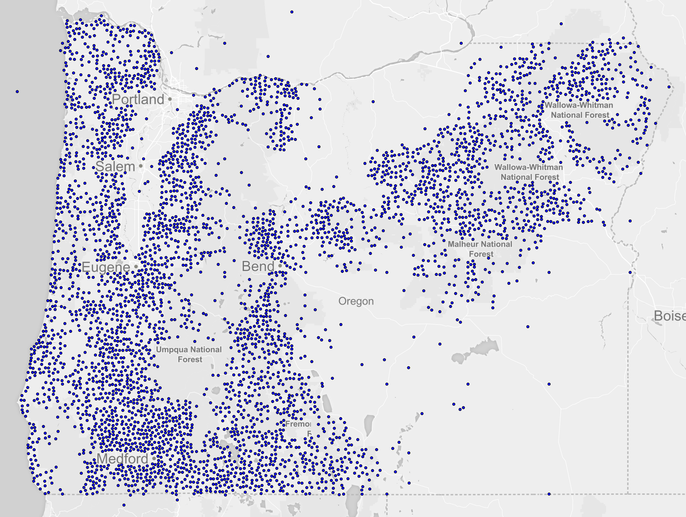
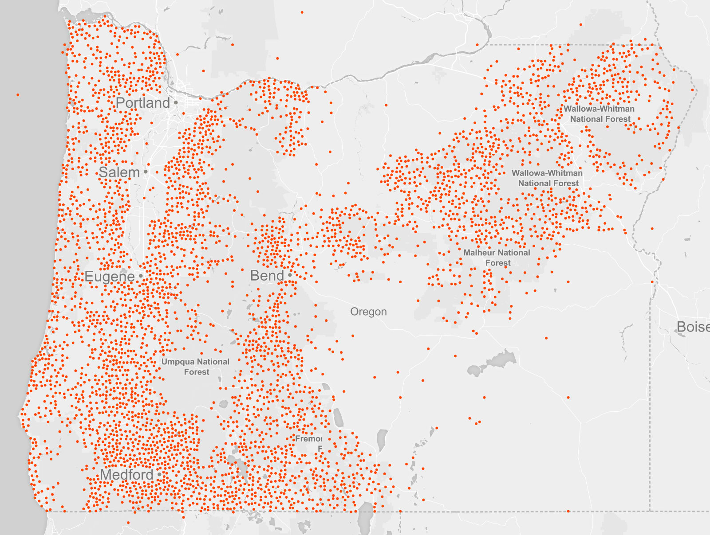
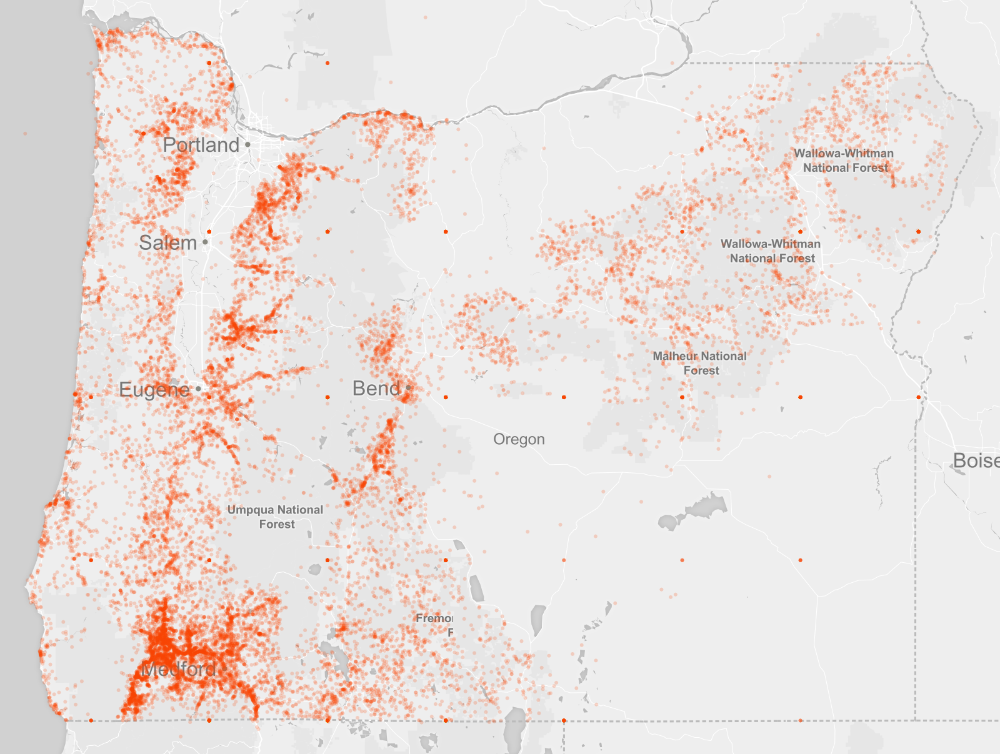
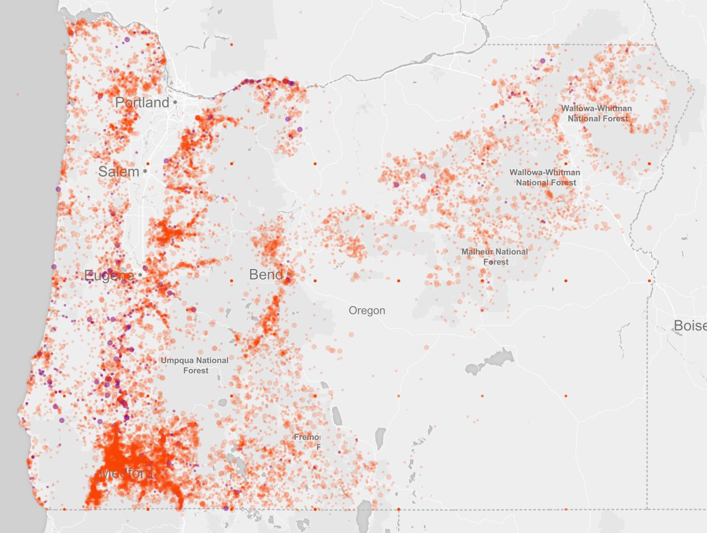

### Welcome
A brief intro.  Who I am.  What I do.  Why I make maps.

### What we're going to create
Describe what we're creating and what we'll learn.

### Intro to MapBox Studio
Not comprehensive.  Talk about the editor.  The CartoCSS markup.
Start by changing a few properties.

### Incendio!
Ask people to import [fire](https://data.oregon.gov/Natural-Resources/2005-2014-Fire-Data/9nkj-mp3y) data source that lives on MapBox.

### Playing With Fire
* Create new project using Mapbox Light
* Add caged.aa3fadad to source
* Create new stylesheet "fire"
* Make the points appear as a marker

```css
#fires {
   marker-width: 3;
 }
```



Point out markers in the ocean and oddly even-spaced points inside Oregon as a good example to be mindful of the conclusions we make about data.

* Change to orangered color, remove outline.

```css
#fires {
  marker-width: 3;
  marker-fill: orangered;
  marker-line-width: 0;
 }
 ```

 

* Note how not all markers aren't drawn.  Enabled `marker-allow-overlap`.

Talk about the disperety between Medford and Portland.  There are about 77k people in Medford vs. about 620k people in Portland.  

Q. What could that tell us about the fires?
A. More people != more fires.  

Q. What do we *think* might be causing the fires in Medford?
A. ...Later

```css
#fires {
  marker-width: 3;
  marker-fill: orangered;
  marker-line-width: 0;
  marker-allow-overlap: true;
  marker-opacity: 0.2;
 }
 ```

  

* Style recent (>=2014) fires a different color.

Discuss the need for some kind of spreadsheet application or a database.  Something that helps you ask questions of the data to find out what message you're trying to convey.

```css
#fires {
  marker-width: 3;
  marker-fill: orangered;
  marker-line-width: 0;
  marker-allow-overlap: true;
  marker-opacity: 0.2;

  [year >= 2014] {
    marker-width: 6;
  }
 }
 ```


* Use description to style "motorist" a different direction.

```css
#fires {
  marker-width: 3;
  marker-fill: orangered;
  marker-line-width: 0;
  marker-allow-overlap: true;
  marker-opacity: 0.2;

  [year >= 2014] {
    marker-width: 6;
  }

  [cause='motorist'] {
   marker-fill: purple;
   marker-opacity: 0.5;
  }
 }
 ```



* Change cause to lightning.  Talk about how it aligns with Medford.

```css
#fires {
  marker-width: 2;
  marker-fill: orangered;
  marker-line-width: 0;
  marker-allow-overlap: true;
  marker-opacity: 0.5;
  marker-comp-op: hard-light;

  [year >= 2014] {
    marker-width: 4;
  }

  [cause='lightning'] {
   marker-fill: purple;
   marker-opacity: 0.5;
  }
 }
```


* Move on to using an emoji or vector symbol for fire

### What next? Things you can do at home
* Followup question:  Why do you think there are no fires in South eastern Oregon?  

* Only render Oregon
* Add county data for context
* Print your map!
* Find data. Have fun. Be responsible.


### Notes
* Metadata isn't basically nonexistent.  Probably around here somewhere http://www.oregon.gov/ODF/Pages/index.aspx
* NFCA - No Fire Crew Action
* About 12% of fires have no description and location.  
